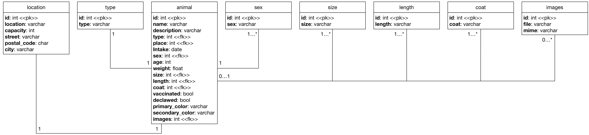

<!-- lint disable no-html -->

# Shelter

> A partially working Express server.
> Can you fix and finish it?


## Install

Fork this repository, `cd` into it, and:

```bash
npm install
npm run build # build and minify static files
npm start # runs server on `localhost:1902`
```

## Todo

There’s a lot of things left to do.
See the [assignment][] description for more info.

## Brief description of code

```txt
build.js - crawls new data (probably not needed)
db/data.json - raw data in json format
db/image/ - images for all animals
db/index.js - interface for accessing data
db/readme.md - docs for `db`
server/ - web server
server/helpers.js - utility functions used in the views to render animals
server/index.js - express server
src/index.css - unprocessed styles
src/index.js - unprocessed scripts
static/ - output of `src` after processing (these are sent to the browser)
view/detail.ejs - ejs template for one animal
view/list.ejs - ejs template for all animals
view/error.ejs - ejs template for errors
```

## Brief description of npm scripts

*   `npm start` — Start the server (on port 1902)
*   `npm test` — Tests the database
*   `npm run lint` — Check browser code and node code for problems
*   `npm run build` — Build browser code


## Database
This project uses [MySQL](https://www.mysql.com) as its program of choice for database management. You need to have it installed. Here are some links for the different platforms it can be installed on:
- [Windows](https://dev.mysql.com/downloads/windows/)
- [Mac](https://gist.github.com/nrollr/3f57fc15ded7dddddcc4e82fe137b58e)
- [Ubuntu/Debian](https://dev.mysql.com/downloads/repo/apt/)
- [CentOS](https://dev.mysql.com/downloads/repo/yum/)

When you've installed it and set it up, execute the following commands in this project folder to import the database dump into your local environment.
```
mysql -u root -p
CREATE DATABASE IF NOT EXISTS db_name (where db_name is the name you specify)
exit
mysql -u root -p db_name < db_shelter.sql (where db_name is again the name you specify)
```

After that, you can copy the `.env.exmaple` from the project root and rename it to `.env` and fill in the host (localhost for most people), database name and your credentials (root username and password).

If everything went well, the node server should connect to the db without any issues!
### DB diagram
Here is a diagram of how the database is put together


### Set up the database

## Data

Data is crawled (by `build.js`) from [nycacc][].
If you have the means to do so, you should consider becoming a foster parent,
volunteering at your local animal shelter, or donating!

## License

[MIT][] © [Titus Wormer][author]

[mit]: license

[author]: http://wooorm.com

[assignment]: https://github.com/cmda-be/course-17-18/blob/master/week-4.md#shelter

[nycacc]: http://nycacc.org
